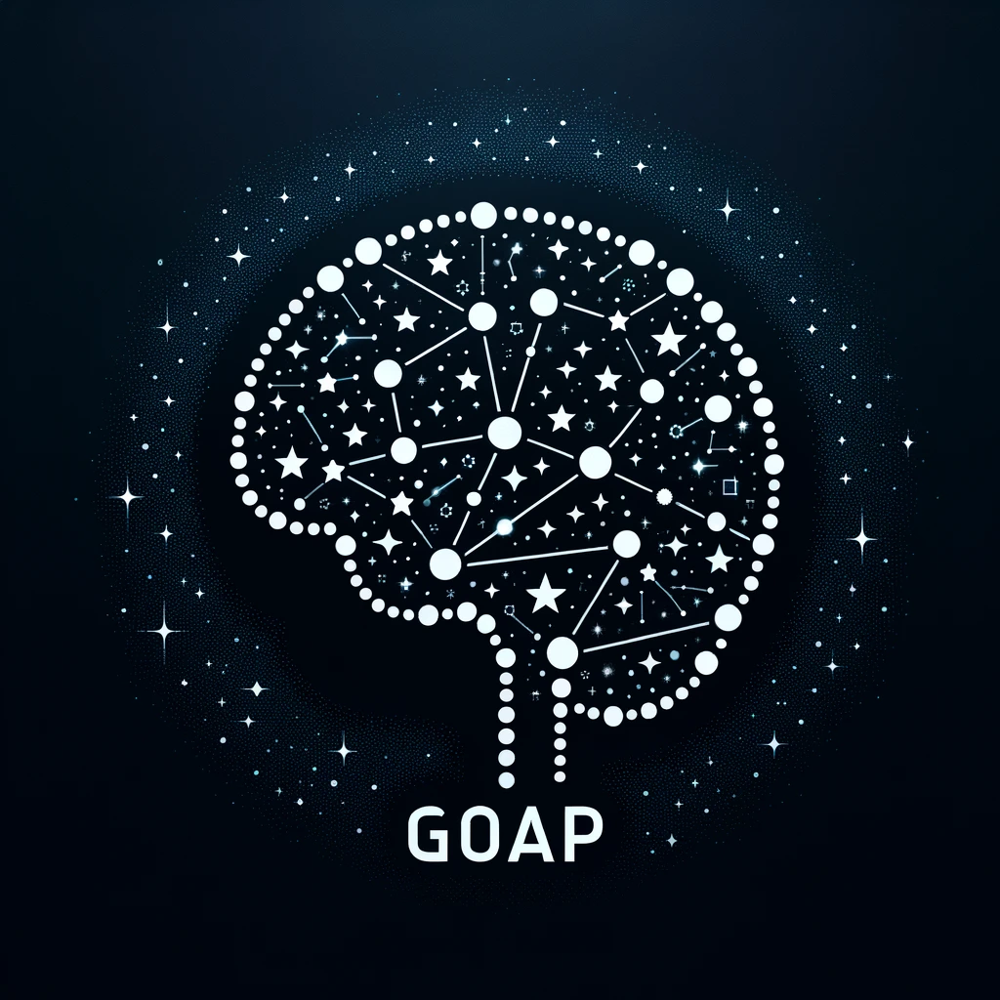

<p align="center" style="font-size: 2.5em">
  G.O.A.P. AI  
</p>
<p align="center">
    
</p>
<p align="center" style="font-size: 1.5em">
  Goal Orientated Action Planning AI
</p>

Goap-AI a library for creating AI agents which plan their actions based on a set of overall goals.
It is suitable for use in games and simulations where the agent needs to respond dynamically to a changing environment.

## Installation

You can install the library into your project with:

```toml
[dependencies]
goap_ai = "0.2.0"
```

Alternatively, you can clone the repository and set your project to use the local copy:

```shell
git clone https://github.com/FreddyWoringham/goap.git goap
cd goap
```

Then build the `goap` binary with:

```shell
cargo build --release
```

After which you can run the tool:

```shell
cargo run --release config.yml
```

## Configuration

A GOAP agent is configured with a set of `Goal`s it is trying to achieve, and a set of `Action`s it can perform.
At each step, the agent will select which `Action` to perform given the current `State` of the environment, and how unfulfilled the `Goal`s are that it is trying to achieve.

### State

A `State` object is a list of key-value pairs which represent a snapshot of the environment:

```yaml
state:
  energy: 50
  health: 20
  num_apples: 2
  num_uncooked_meat: 0
  num_cooked_meat: 0
```

### Goals

`Goals` are essentially target values of the `State` which the agent is trying to achieve:

```yaml
goals:
  health:
    target: 100
    kind: GreaterThanOrEqualTo
    weight: 4
  energy:
    target: 100
    kind: GreaterThanOrEqualTo
    weight: 1
```

When planning its actions, an agent will try and minimise "discontentment": the total difference between the current `State` and the `Goal`s it is trying to achieve.

$discontentment = \sum_{i=1}^{n} weight_i \times state_i - goal_i$

> Note: This is representative of `GreaterThanOrEqualTo` goals, but different kinds of goals will use different formulae when calculating their discontentment with the current state.

### Actions

`Actions` are the things an agent can do to change the `State` of the environment in order to achieve its `Goal`s (minimise discontentment).

```yaml
actions:
  gather:
    duration: 1
    deltas:
      energy: -5
      num_apples: 5
  hunt:
    duration: 20
    deltas:
      energy: -10
      num_uncooked_meat: 3
  cook:
    duration: 2
    deltas:
      energy: -5
      num_uncooked_meat: -1
      num_cooked_meat: 1
  eat_apple:
    duration: 1
    deltas:
      energy: 5
      health: 5
      num_apples: -1
  eat_cooked_meat:
    duration: 1
    deltas:
      energy: 20
      health: 30
      num_cooked_meat: -1
  rest:
    duration: 5
    deltas:
      energy: 10
  wait:
    duration: 1
    deltas:
      energy: -1
```

### Planner

#### Algorithms

Our planner offers three primary algorithms, each optimized for specific scenarios and requirements:

- **Traditional Planning**
- **Efficiency-Based Planning**
- **Hybrid Planning**

Each algorithm operates in one of two solution modes:

- **Fast**: Prioritizes speed, delivering quick but potentially suboptimal plans.
- **Best**: Seeks the most optimal plan, which may require more computational resources and time.

##### 1. Traditional Planning

**Description:**  
Utilizes an exhaustive depth-first search approach to explore all possible action sequences up to a specified `max_depth`. This method aims to minimize total discontentment without considering the time efficiency of actions.

**Use Case:**  
Ideal for scenarios where achieving the lowest possible discontentment is crucial, and there are no strict time constraints.

##### 2. Efficiency-Based Planning

**Description:**  
Focuses on maximizing discontentment reduction per unit of time. This approach favors actions that offer the most significant improvement in discontentment for the least time investment.

**Use Case:**  
Perfect for time-critical tasks where actions have varying durations, and quick responsiveness is essential.

##### 3. Hybrid Planning

**Description:**  
Combines both traditional and efficiency-based strategies. It dynamically switches between minimizing discontentment and optimizing efficiency based on the current planning context.

**Use Case:**  
Suitable for complex environments where both optimal discontentment reduction and time efficiency are important, allowing the planner to adapt to changing priorities.

#### Solution Modes

##### **Fast**

**Description:**  
Employs heuristic-based algorithms (e.g., A\*) to generate plans swiftly. While faster, these plans may not always be the most optimal.

**Advantages:**

- Quick response time
- Suitable for real-time applications

**Trade-offs:**

- Potentially suboptimal plans compared to exhaustive search methods

##### **Best**

**Description:**  
Uses exhaustive search techniques to explore all possible action sequences up to `max_depth`, ensuring the most optimal plan is found.

**Advantages:**

- Guarantees the lowest possible discontentment

**Trade-offs:**

- Higher computational cost
- Longer planning time

#### Selecting the Right Algorithm and Solution

| **Scenario**                   | **Efficiency-Based Planning**                      | **Traditional Planning**                               | **Hybrid Planning**                                        |
| ------------------------------ | -------------------------------------------------- | ------------------------------------------------------ | ---------------------------------------------------------- |
| **Time-Critical Tasks**        | ✅ **Best choice** (maximizes gains per time unit) | Struggles with time limits                             | ✅ **Balanced choice** (optimizes speed and quality)       |
| **Critical Threshold Goals**   | Struggles with thresholds                          | ✅ **Best choice** (directly minimizes discontentment) | ✅ **Flexible choice** (adapts to threshold needs)         |
| **Long-Term Optimization**     | May overlook global optima                         | ✅ **Best for overall balance**                        | ✅ **Adaptive choice** (balances long-term and short-term) |
| **Dynamic, Real-Time Systems** | ✅ **Adapts well to changes**                      | Struggles with rigid priorities                        | ✅ **Highly adaptable** (switches strategies as needed)    |

#### Configuration

You can set the maximum number of steps the agent will take to plan a sequence of actions using the following YAML configuration:

```yaml
plan:
  max_depth: 10
  algorithm: Traditional
  solution: Fast
```

## Run

With a complete configuration such as the one below:

```yaml
max_depth: 10
algorithm: Traditional
solution: Fast
state:
  energy: 50
  health: 20
  num_apples: 2
  num_uncooked_meat: 0
  num_cooked_meat: 0
goals:
  health:
    target: 100
    kind: GreaterThanOrEqualTo
    weight: 4
  energy:
    target: 100
    kind: GreaterThanOrEqualTo
    weight: 1
actions:
  gather:
    duration: 1
    deltas:
      energy: -5
      num_apples: 5
  hunt:
    duration: 20
    deltas:
      energy: -10
      num_uncooked_meat: 3
  cook:
    duration: 2
    deltas:
      energy: -5
      num_uncooked_meat: -1
      num_cooked_meat: 1
  eat_apple:
    duration: 1
    deltas:
      energy: 5
      health: 5
      num_apples: -1
  eat_cooked_meat:
    duration: 1
    deltas:
      energy: 20
      health: 30
      num_cooked_meat: -1
  rest:
    duration: 5
    deltas:
      energy: 10
  wait:
    duration: 1
    deltas:
      energy: -1
```

You can then generate a plan of action:

```text
                                                 n
                                                 u
                                      n          m
                                      u          _
                                      m          u
                                      _          n
                                      c          c
                           n          o          o
                           u          o          o
                           m          k          k
                           _          e          e
     e          h          a          d          d
     n          e          p          _          _
     e          a          p          m          m
     r          l          l          e          e
     g          t          e          a          a
     y          h          s          t          t
   50         20          2          0          0      (370.00) [init]
   40 -10     20          2          0          3 +3   (380.00) hunt
   35 -5      20          2          1 +1       2 -1   (385.00) cook
   55 +20     50 +30      2          0 -1       2      (245.00) eat_cooked_meat
   50 -5      50          2          1 +1       1 -1   (250.00) cook
   70 +20     80 +30      2          0 -1       1      (110.00) eat_cooked_meat
   65 -5      80          2          1 +1       0 -1   (115.00) cook
   85 +20    110 +30      2          0 -1       0      (15.00) eat_cooked_meat
   95 +10    110          2          0          0      (5.00) rest
  105 +10    110          2          0          0      (0.00) rest
```

Understanding the Output:

- State Transitions: Each line represents the state of various properties (e.g., energy, health) before and after an action.
- Action Labels: Actions taken by the agent (e.g., hunt, cook, eat_cooked_meat, rest) are displayed alongside their effects.
- Discontentment Score: The number in parentheses (e.g., (370.00)) represents the total discontentment after each action.
- Action Effects: Changes to state properties are indicated with + (increase) or - (decrease) values.

## Integration

If you're integrating this ai library into a game or simulation, use the following steps:

1. Define `Goal`s that the agent is trying to achieve.
2. Generate a observable `State` object representing the current environment from an agent's perspective.
3. Determine the set of `Action`s the agent can perform to change the `State`.
4. Configure the planner with the desired algorithm and solution mode.
5. Generate a plan of action based on the current `State`, `Goal`s, and `Action`s.

It's recommended that your agent should re-plan its actions after each step it takes in the environment so that it regularly adapts to changing conditions.
